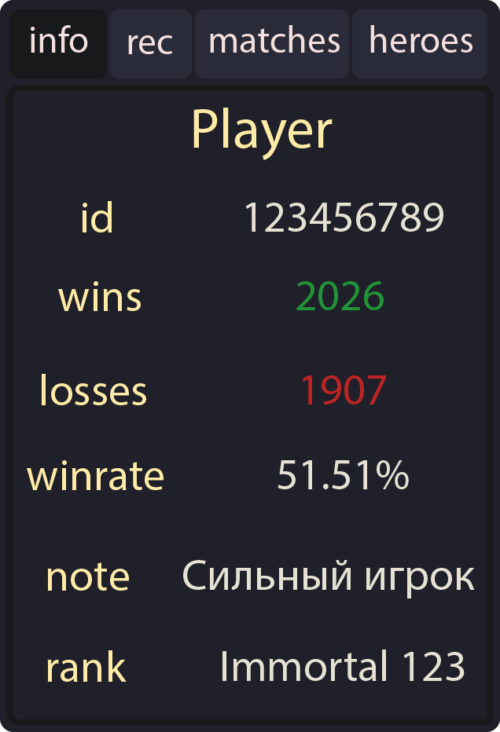
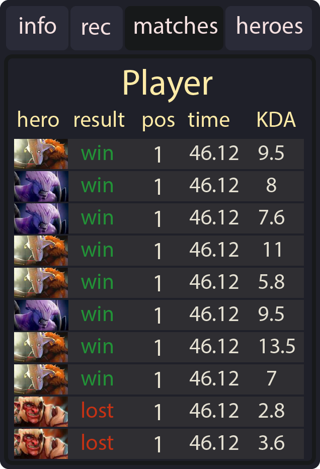
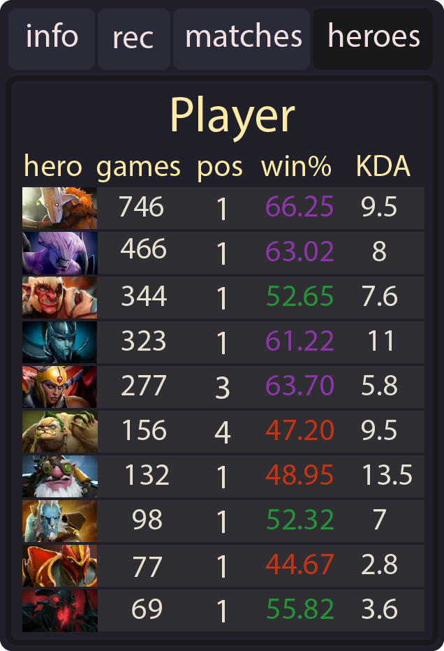
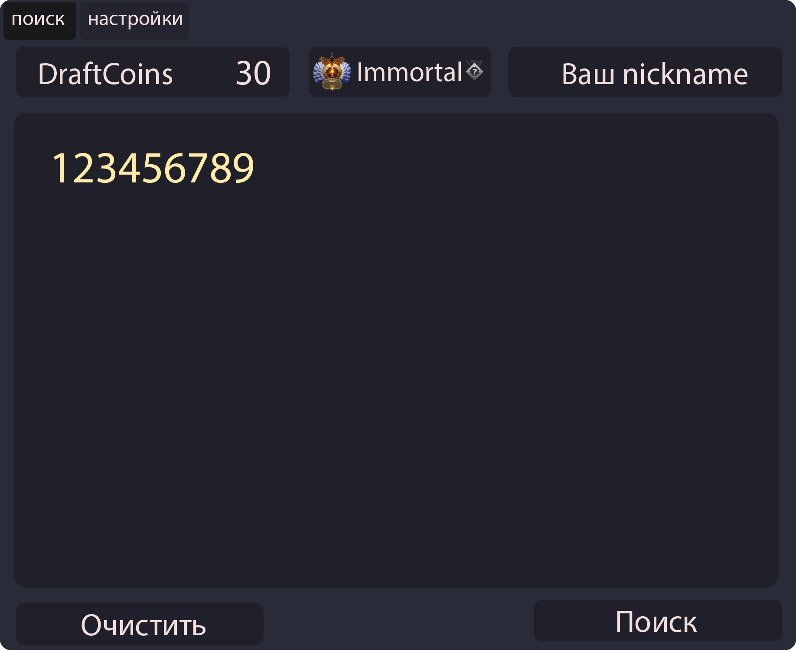
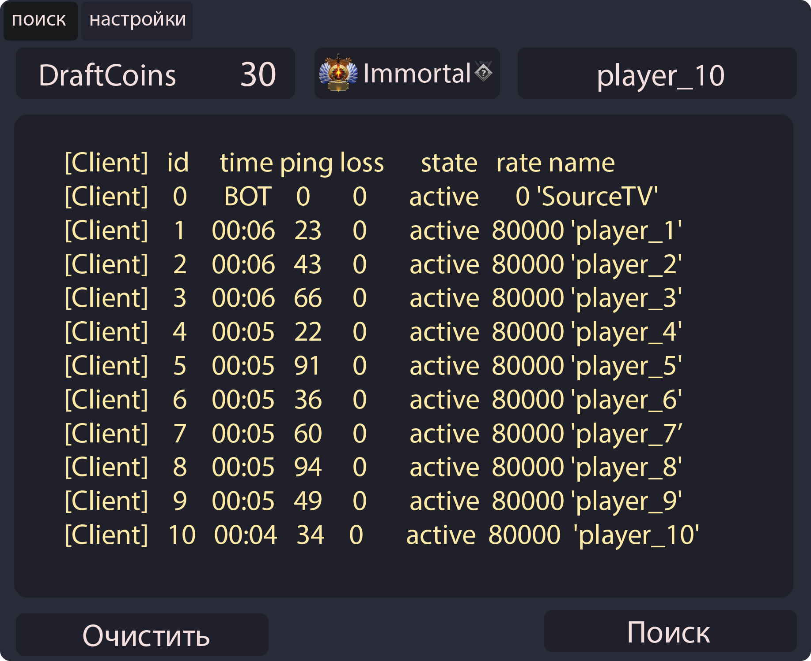

<p align="center">
  
</p>

<h1 align="center">DraftMaster</h1>
<h3 align="center">Ваш помощник в мире Dota 2! 🏆</h3>

<p align="center">
  <strong>DraftMaster</strong> — удобное и функциональное приложение для поиска и анализа игроков Dota 2
</p>

<p align="center">
  <a href="https://api.draftmaster.online/application/download">
    
  </a>
  <a href="https://t.me/DraftMaster_dota">
    
  </a>
</p>

---

## 📊 О проекте

DraftMaster — это мощный инструмент для анализа статистики игроков Dota 2. С его помощью вы можете быстро получить подробную статистику по любому профилю, увидеть оценку игрока, сформированную на основе его матчей, а также возможность подписаться на интересующих игроков.

## 🛠️ Технологии

### Backend

Проект использует **FastAPI** для создания REST API

### Frontend

Клиентское приложение написано на **C++** с использованием **Qt**

## ✨ Возможности

### 🔍 **Информация об игроке**

- Основная статистика: ID, количество побед и поражений
- Винрейт и текущий ранг
- Система подписки на игроков

### 📈 **Рекомендации**

- Краткий анализ игрока за последние 15 матчей
- Популярные герои и предпочитаемые позиции
- KDA и общая оценка эффективности

### 🎮 **История матчей**

- Детальная статистика последних 15 игр
- Герои, результат, позиция и длительность матчей
- Показатели KDA для каждого матча

### 🦸 **Популярные герои**

- Список наиболее часто выбираемых героев
- Статистика побед и эффективности по каждому герою
- KDA для каждого героя

## 🔎 Как искать игроков

### **Поиск по ID**

Введите ID игрока, чтобы получить подробную информацию о нем. Поиск по ID не расходует DraftCoins.

### **Поиск по именам**

1. Откройте консоль во время матча Dota 2
2. Введите команду `status`
3. Скопируйте данные в приложение
4. Получите детальную статистику по последним 15 матчам каждого игрока

## 📥 Скачать

### Системные требования

- **ОС:** Windows 10/11
- **Дополнительно:** Установленная Dota 2 для полнофункциональной работы

### Установка

```bash
# Скачайте последнюю версию по ссылке ниже
```

<p align="center"> <a href="https://api.draftmaster.online/application/download">  </a> </p>

## 🖼️ Скриншоты

### 📊 Основная информация

#### Основная статистика игрока: ID, победы/поражения, винрейт, ранг и система подписки



### 📈 Рекомендации и анализ

#### Краткий анализ игрока: популярные герои, позиция, винрейт, KDA и общая оценка


### 🎮 История матчей

#### История 15 последних игр: герои, результат, позиция, длительность и KDA



### 🦸 Популярные герои

#### Список популярных героев игрока с играми, винрейтом и KDA



### 🔍 Поиск по ID

#### Поиск игрока по ID - не расходует DraftCoins



### 👥 Поиск по именам

#### Поиск по данным из консоли Dota 2 (команда `status`)



## 💬 Поддержка

По вопросам сотрудничества и технической поддержки обращайтесь:

- **📧 Email**: [support@draftmaster.online](mailto:support@draftmaster.online)
- **📱 Telegram**: [@fidych619](https://t.me/fidych619)

## 👨‍💻 Разработчик

**Feed619**  
[](https://github.com/feed619)

---

<div align="center">

### 🚀 Готовы начать?

<a href="https://api.draftmaster.online/application/download">
  
</a>

<br>

_DraftMaster — ваш надежный помощник в мире competitive Dota 2_  
[🌐 Официальный сайт](https://draftmaster.online/) •
[📢 Telegram канал](https://t.me/DraftMaster_dota) •
[📧 Поддержка](mailto:support@draftmaster.online)

</div>
